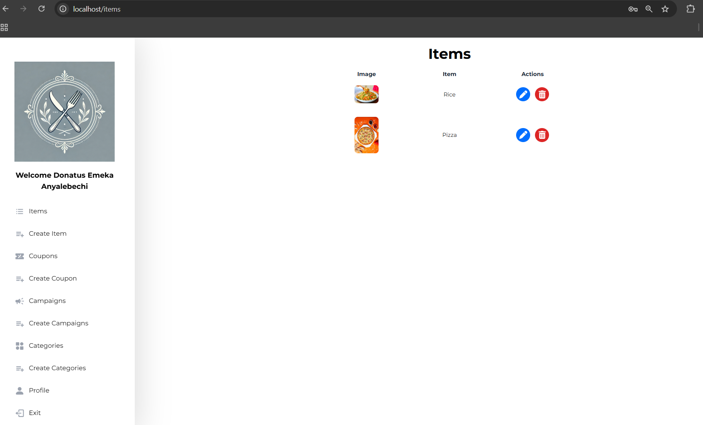
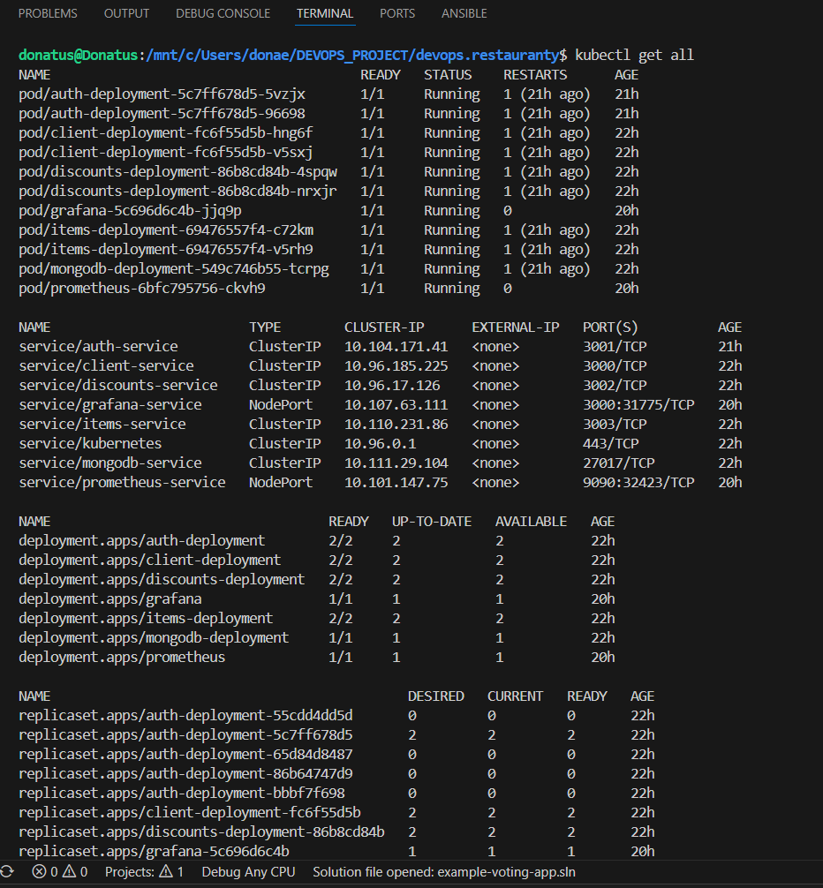
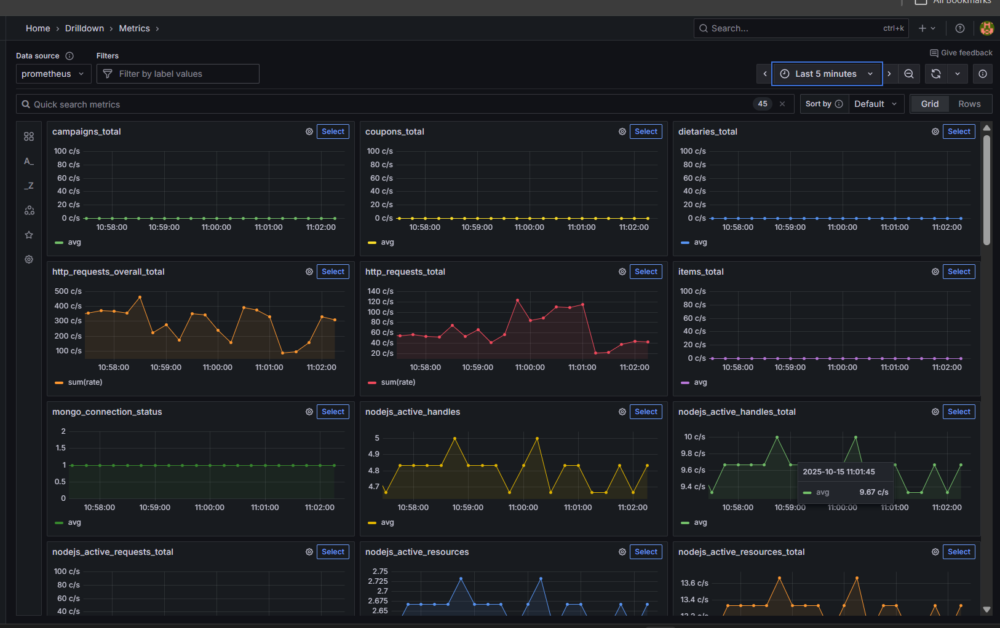
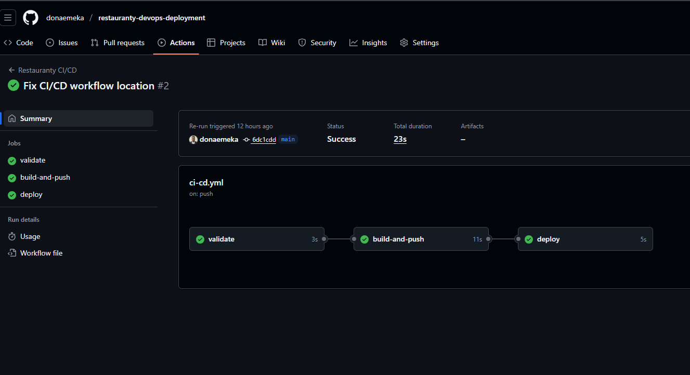

# Restauranty - End-to-End DevOps Deployment

## 📋 Project Overview

**Restauranty** is a full-stack restaurant management system built with microservices architecture and deployed using production-grade DevOps practices. This project demonstrates end-to-end infrastructure skills from local development to production monitoring.

**What problem does it solve?** Modern restaurants need multiple digital services (menu, orders, discounts, authentication) that must work together reliably. This project shows how to build, deploy, and maintain such systems using modern DevOps tools.


## 🏗️ Architecture Overview

**Core Components:**

   - **Frontend:** React.js application

   - **Backend Services:** Auth, Items, Discounts (Node.js)

   - **Database:** MongoDB

   - **Orchestration:** Kubernetes with ingress routing

   - **Monitoring:** Prometheus + Grafana

   - **Security:** Network Policies & secret management


## 🔧 Technology Stack

| Layer | Technology | Implementation |
|-------|------------|----------------|
| **Application** | React.js + Node.js | Frontend UI & Backend Microservices |
| **Containerization** | Docker + Multi-stage builds | Package and isolate services |
| **Orchestration** | Kubernetes (Minikube) | Container deployment & management |
| **Networking** | NGINX Ingress + Services | Routing & service discovery |
| **Database** | MongoDB | Data persistence |
| **Monitoring** | Prometheus + Grafana | Metrics collection & visualization |
| **CI/CD** | GitHub Actions | Automated testing & deployment |
| **Security** | Network Policies + Secrets | Secure service communication |
| **Infrastructure** | YAML Manifests | Infrastructure as Code |


## 📸 Project Screenshots


| Application Running | Kubernetes Dashboard | Monitoring | CI/CD Pipeline |
|---------------------|----------------------|------------|----------------|
|  |  |  |  |


## 🚀 Quick Start

### Prerequisites
   - Docker & Docker Compose
   - Kubernetes (Minikube recommended)
   - kubectl

### Step 1: Clone and Explore
   - git clone https://github.com/donaemeka/restauranty-devops-deployment
   - cd restauranty-devops-deployment

### Step 2: Local Development (Optional)
   - cd infrastructure
   - docker-compose up -d
   -  Access: http://localhost
 

### Step 3: Kubernetes Deployment
**Deploy everything with**
   - kubectl apply -f k8s/

**Create network access**
   - minikube tunnel

   **Access application**
   - open http://localhost

### Step 4: Verify Deployment
   - kubectl get all
   - kubectl get ingress


### 🛠️ Detailed DevOps Implementation

**Phase 1: Containerization**

Each service is containerized with optimized Dockerfiles:

- **Example from backend/auth/Dockerfile**

```text
FROM node:18-alpine

WORKDIR /app

COPY package*.json ./

RUN npm ci --only=production

COPY . .

EXPOSE 3001

CMD ["npm", "start"]
```


### Phase 2: Kubernetes Orchestration
Deployment manifests for each service with:

   - Resource limits and requests

   - Readiness and liveness probes

   - Service discovery

   - ConfigMap and Secret management


### Phase 3: Networking & Routing
**Ingress controller configuration:**

```text
apiVersion: networking.k8s.io/v1

kind: Ingress

metadata:

  name: restauranty-ingress

spec:

  rules:

  - http:

      paths:

      - path: /api/auth

        pathType: Prefix

        backend:

          service:

            name: auth-service

            port:

              number: 3001
```


### Phase 4: Monitoring & Observability
   - Prometheus for metrics collection

   - Grafana dashboards for visualization

   - Service health monitoring

   - Custom business metrics


### Phase 5: Security
   - Network Policies for service isolation

   - Secret management without hardcoded credentials

   - Non-root container execution

   - Security contexts


### Phase 6: CI/CD Automation
GitHub Actions pipeline:

   - Automated testing and validation

   - Docker image building

   - Deployment readiness checks           


## 📁 Project Structure

```text
restauranty-devops-deployment/
├── backend/                 # 3 Node.js Microservices
├── client/                 # React Frontend
├── k8s/                    # Kubernetes Infrastructure
│   ├── auth/               # Auth Service Deployment
│   ├── items/              # Items Service Deployment
│   ├── discounts/          # Discounts Service Deployment
│   ├── client/             # Frontend Deployment
│   ├── mongodb/            # Database Setup
│   ├── monitoring/         # Prometheus + Grafana
│   ├── security/           # Network Policies
│   └── ingress.yaml        # Routing Rules
├── infrastructure/         # Local Development
├── .github/workflows/      # CI/CD Pipeline
├── screenshots/            # Project Screenshots
└── README.md               # Project Documentation
```

### 🔧 Configuration & Customization

1. ### Environment Setup
   - Copy k8s/secrets-template.yaml to k8s/secrets.yaml

   - Fill in your environment-specific values

   - Apply: kubectl apply -f k8s/secrets.yaml

2. ### Service Configuration
   - Modify ports in k8s/ingress.yaml

   - Adjust resource limits in deployment files

   - Customize monitoring thresholds


### 📊 Monitoring & Troubleshooting
Access Monitoring Stack
   - kubectl port-forward service/grafana-service 8080:3000 &
   - kubectl port-forward service/prometheus-service 9090:9090 &

**URLs:**
   - Application: http://localhost
   - Grafana: http://localhost:8080 (admin/admin)
   - Prometheus: http://localhost:9090

### Common Issues & Solutions
1. ### Application not accessible?

**Check if ingress is running**
- kubectl get ingress

**Verify minikube tunnel**
- minikube tunnel

**Check pod status**
- kubectl get pods


2. ### Services not communicating?

**Check network policies**
- kubectl get networkpolicies

**Verify service endpoints**
- kubectl get endpoints


## 🎯 DevOps Skills Demonstrated

| Category | Technologies Used | Implementation Evidence |
|----------|-------------------|------------------------|
| **Containerization** | Docker, Multi-stage builds | Optimized Dockerfiles for each microservice |
| **Orchestration** | Kubernetes, Minikube | Production-ready deployment manifests |
| **Networking** | Ingress, Services, DNS | Proper service discovery & routing rules |
| **Monitoring** | Prometheus, Grafana | Real-time metrics collection & dashboards |
| **Security** | Network Policies, Secrets | Secure service communication & credentials |
| **CI/CD** | GitHub Actions | Automated testing & deployment pipeline |
| **Infrastructure as Code** | YAML, Kustomize | Version-controlled infrastructure configuration |
| **Microservices** | Node.js, React | Distributed system design & communication |


### 📈 Business Value
This project demonstrates how proper DevOps practices deliver:

   - Faster deployments - from days to minutes

   - Improved reliability - monitoring and auto-healing

   - Better security - built-in security controls

   - Cost optimization - efficient resource usage

   - Scalability - handle growth without re-architecture


### 📄 License
MIT License - feel free to learn from this project!


### 👨‍💻 About Me
**Donatus Emeka Anyalebechi**

**Staatlich geprüfter Informatiker (Softwaretechnologie)**

J**unior DevOps Engineer**

📍 Based in: Germany

📧 Email: donaemeka92@gmail.com

💼 LinkedIn: linkedin.com/in/donatus-devops

🐙 GitHub: github.com/donaemeka

- **Seeking: Junior DevOps Engineer positions in Germany (On-site or Remote)**

This project demonstrates my practical DevOps skills and readiness for production environments.

Built with ❤️ to demonstrate real-world DevOps skills
